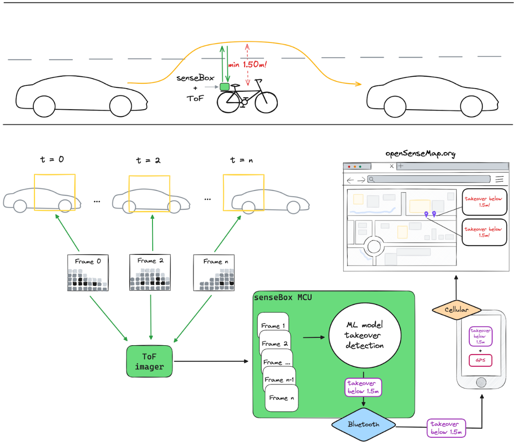

# Detecting dangerous takeovers on a bicycle

In this repo the usage of a recurrent neural network for detecting when a car overtakes a bicycle at a dangerously close distance based on low resolution depth videos is explored.

## Contents

This repo contains code for:
- `./training/`: training and testing the neural network. This folder also contains the recorded and labeled trainingsdata.
- `./deployment/sensebox/`: deploying the trained network on a senseBox MCU S2 with a VL53L8CX sensor for recording the depth images
- `./data-collection/`: collecting more data for training the neural network

## Concept

## Hardware setup on a bicycle carrier

