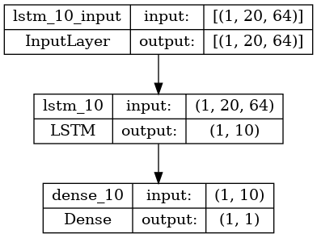
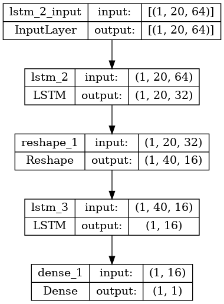
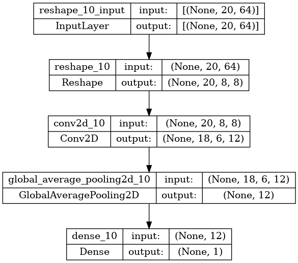
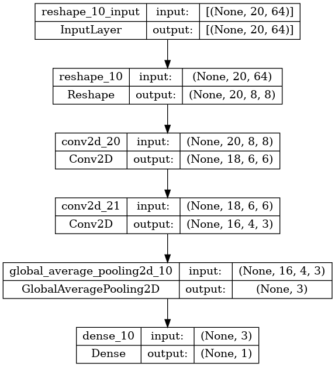
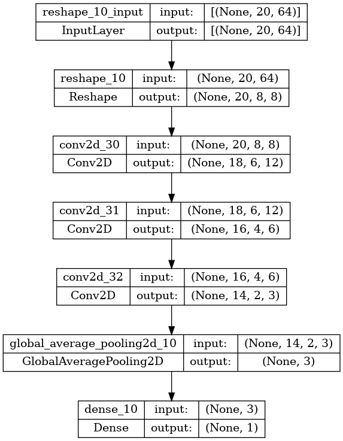

## Preprocessing the data
Use the `label_csv.py` to label the csv files according to given timestamps (given by Luca). Then use `csv_to_traintestval_pkl.py` to randomly split the data from the csv files into training, testing and validation sets and store these sets as pkl for future easy access.

The resulting pkl files are normalized to aid the training of the model. The normalization is done by dividing each value by 2000. Note, that this also has to be done with the live data during deployment.

---

## Training the model
Use `train_cross_val.py` to train a model with the pkl files from the previous step. At the beginning of the file there is a variable `cnn` which lets you switch between the cnn model or the lstm. Check out the function `create_model` to see what kind of model is currently being build. 

To turn the resulting trained tflite model into an array of bytes for running it on a microcontroller use the following command:

`xxd -i models/model.tflite > model.cc`

In general, the trainings are conducted with early stopping and with a batch size of 64 using an Adam optimizer. Performance is evaluated using k-fold Cross-Validation using 10 folds.

#### LSTM
I tested the following LSTMs structures:

|   | Model A  | Model B  |
|---|---|---|
| Structure  |   |   |
| Inference on ESP32S2  | 50ms  | 275ms  |
| Tensorflow accuracy  | 0.9694 (+- 0.0167)  | 0.9789 (+- 0.0153)  |
| Tflite accuracy  | 0.7380 (+- 0.0943)  | 0.6940 (+- 0.0745)  |

#### CNN
I tested the following LSTMs structures:

Performance of Models:
|   | Model A  | Model B  | Model C  |
|---|---|---|---|
| Structure  |   |   |   |
| Inference on ESP32S2  | 77ms  | 47ms  | 113ms  |
| Tensorflow accuracy  | 0.9630 (+- 0.0142)  | 0.9592 (+- 0.0247)  | 0.9790 (+- 0.0163)  |
| Tflite accuracy  | 0.9630 (+- 0.0142)  | 0.9592 (+- 0.0247)  | 0.9790 (+- 0.0163)  |

Currently I can achieve similar accuracies with both the CNN and the LSTM model. Once I convert them to tflite, the LSTM model significantly looses accuracy. Therefor the CNN approach is currently preferred.

#### CNN + LSTM ??
It might be worth a try to combine Conv2D and LSTM layers. I cant get that to run on the microcontroller though (It crashes, if I flash such a model onto it...).

To be investigated....

---

## Testing the model
Use `test_tflite.py` to test the performance of a trained model and its corresponding tflite version.

---

# Note
I am currently trying out multiclass classification (no takeover, car, bike) and added a version of the preprocessing, training and testing files.